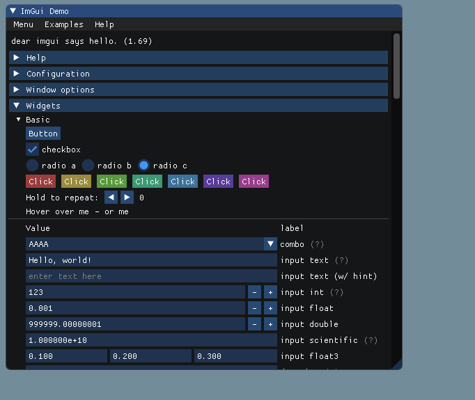

## Introduction to ImGui

### What is ImGui?
ImGui is a bloat-free graphical user interface library for C++ that is easy to integrate and use. It allows developers to quickly create UIs for tools and in-game interfaces with minimal code.

### Why Use ImGui?
- **Immediate Mode**: Simplifies GUI rendering and allows easy integration.
- **Ease of Use**: Simple API to create complex interfaces.
- **Performance**: Designed to be efficient and fast.

---

## Getting Started with ImGui
#### introduction to GUI programming
 * Retained mode vs immediate mode gui
 * What are Backends (Graphics api's and libraries)
#### Setting Up ImGui on Linux

#### Setting Up ImGui with Visual Studio code

## Basics
#### Design princple of imgui
* imgui basis without a backend
* choosing a backend
### Showing an Empty Window with ImGui
- **Code example**: Basic initialization and rendering of an empty window.

#### Creating a Simple Interface
- **Code example**: Creating buttons, sliders, and text displays.

#### Handling Inputs and Events
- **Explanation**: How ImGui processes inputs and events.

## Drawing

### Drawing Basic Shapes with ImGui
- **Code example**: Drawing lines, rectangles, circles, and other primitives.

### Custom Widgets
- **Guide**: Creating custom widgets for more complex UI components.

## Advanced Usage

### Creating Complex Interfaces
- **Examples**: Using tables, lists, and more advanced widgets.

### Extending ImGui
- **Guide**: Adding new functionalities and integrating other libraries.

## Game Mechanics

### ImGui for Game Tools
- **Examples**: Creating in-game debugging tools, level editors, and other utilities.

### Real-time Data Visualization
- **Examples**: Plotting graphs and visualizing game data.

## Customization

### Changing Styles and Themes
- **Guide**: Customizing the look and feel of ImGui windows and widgets.

### Using Custom Fonts
- **Guide**: Loading and using custom fonts in ImGui.

## Integration

### Integrating ImGui with Other Libraries
- **Guide**: Using ImGui with other graphics and input libraries.

### ImGui in a Game Loop
- **Guide**: Properly integrating ImGui within a game's main loop for efficiency.